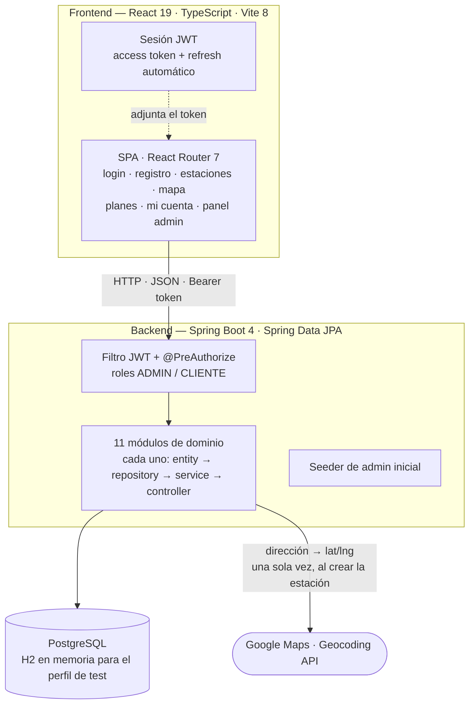
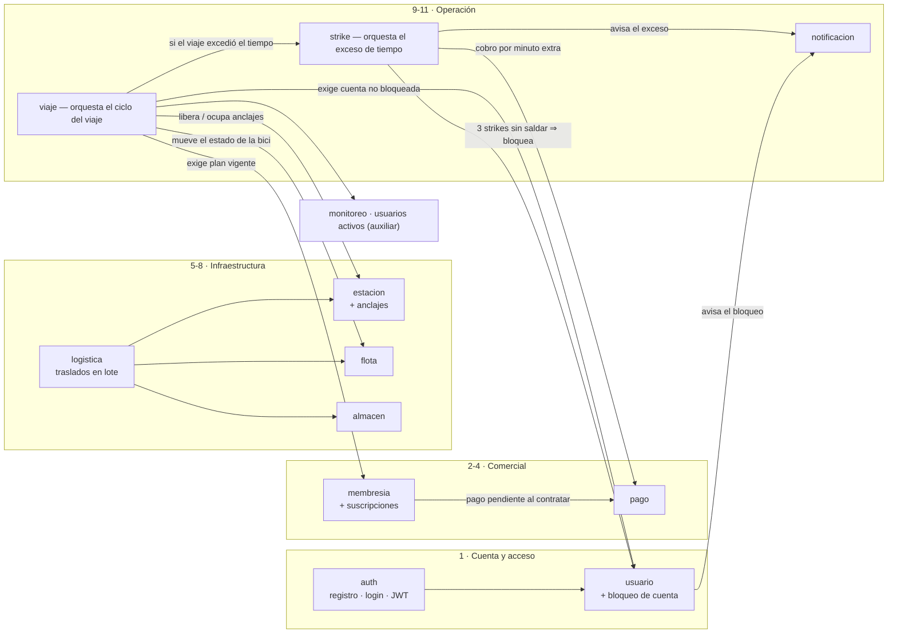
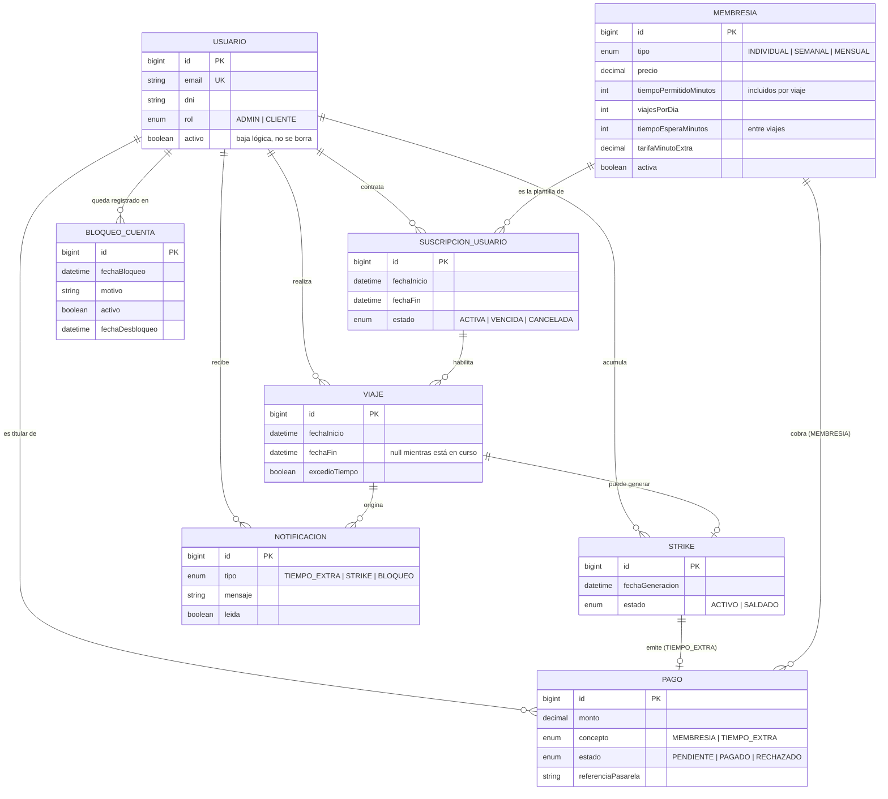
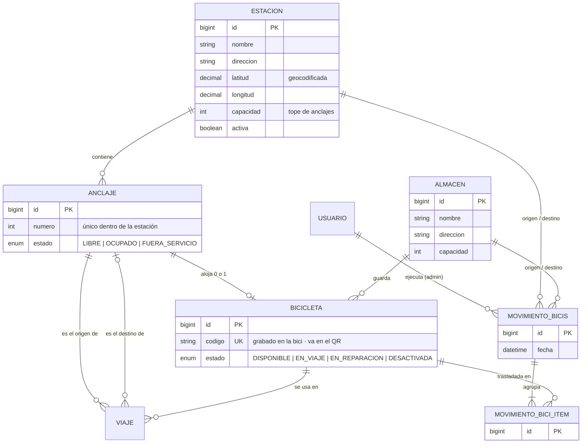
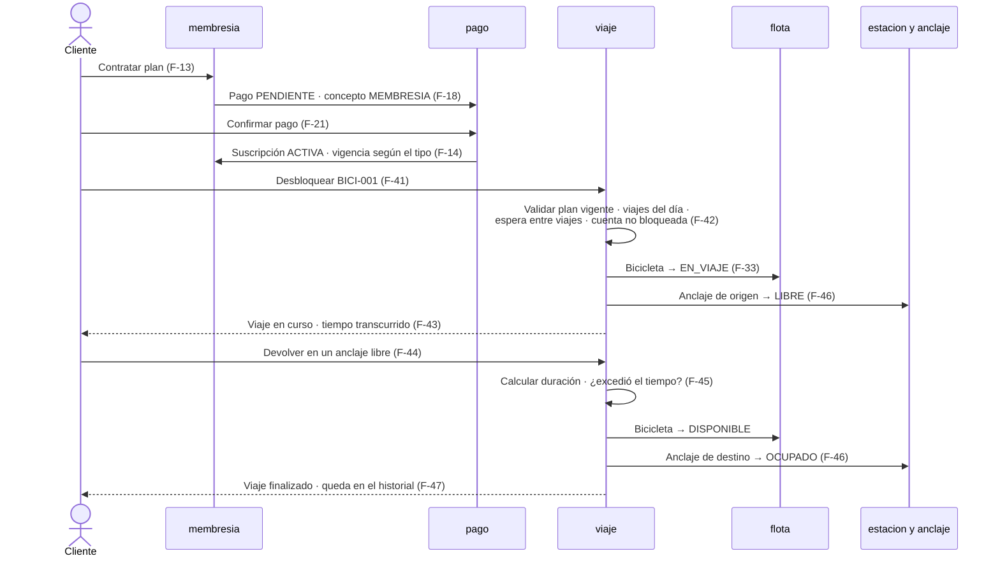
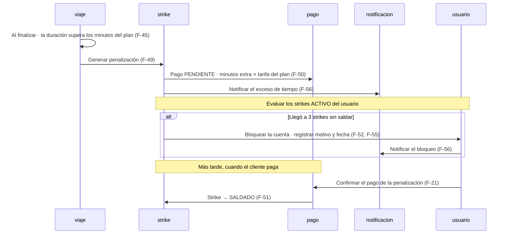
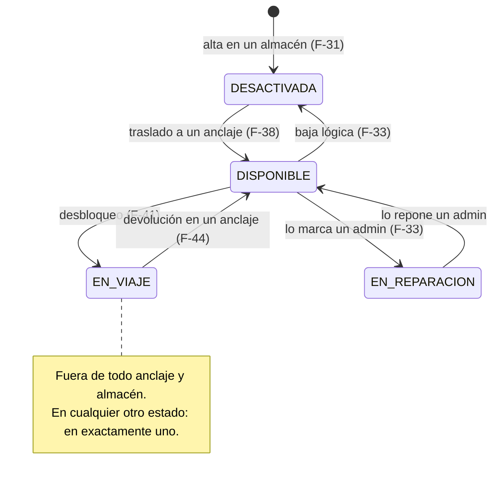
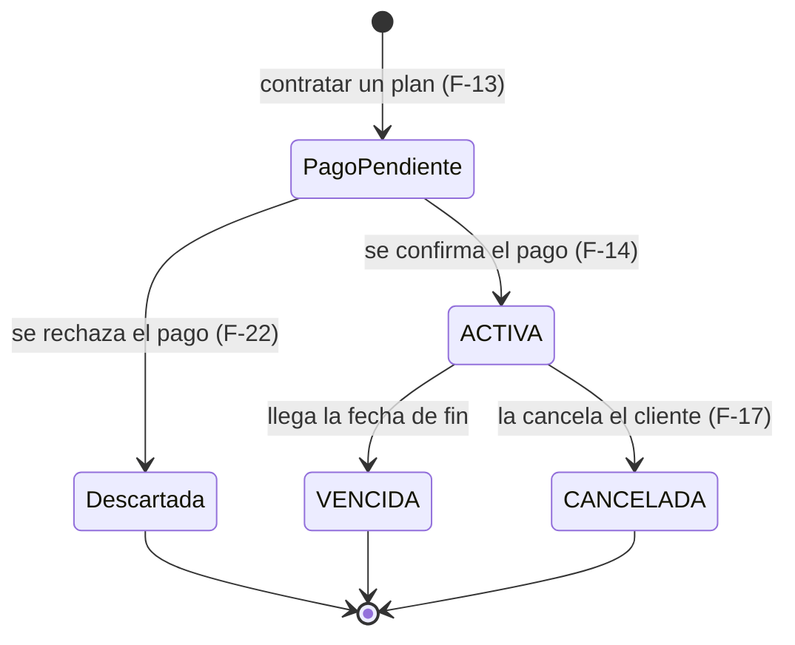
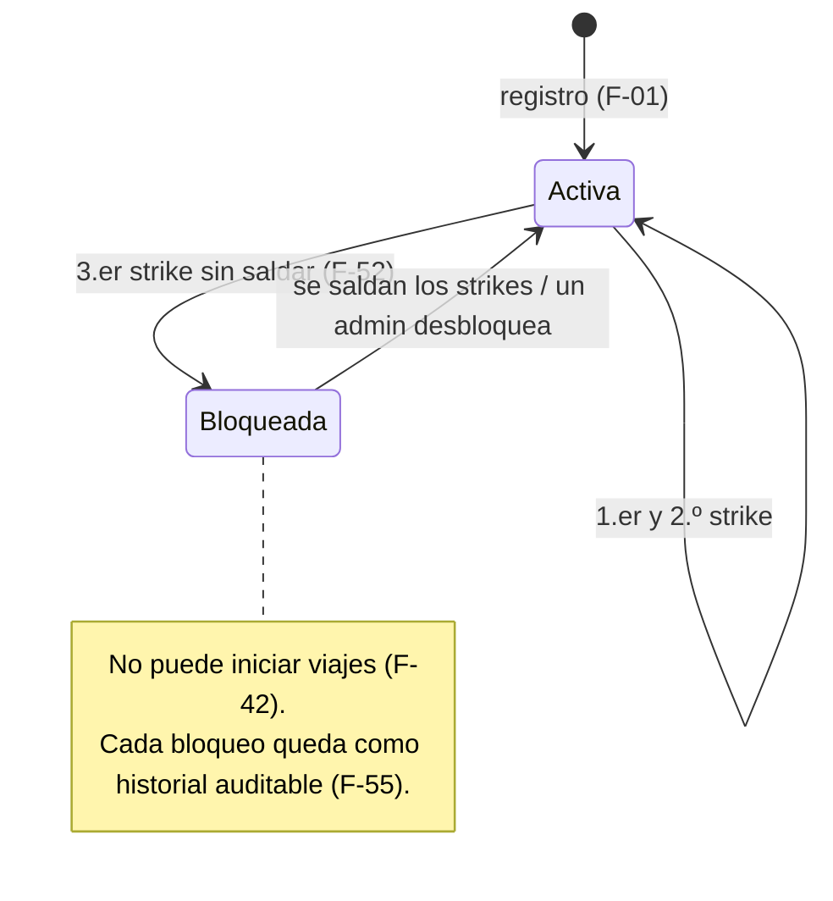

# PeopleBikes — Diagramas del sistema

Sistema de transporte público en bicicletas compartidas. El cliente retira una
bicicleta de una estación y la devuelve en cualquier otra, dentro de los límites
del plan que contrató.

- **Alcance funcional completo:** [ALCANCE.md](ALCANCE.md) — 59 funciones (F-01…F-59) en 11 módulos.
- **Patrones de arquitectura:** [patrones.md](patrones.md).
- **Stack:** Spring Boot 4 + Spring Data JPA + PostgreSQL en el backend · React 19 + TypeScript + Vite 8 + React Router 7 en el frontend.
- El nombre heredado *MediConecta* sobrevive solo en el package Java (`com.mediconecta.*`); el producto es **PeopleBikes**.

> Los bloques ```` ```mermaid ```` se renderizan en GitHub, VS Code y la mayoría de los visores de Markdown. Para exportarlos a imagen: <https://mermaid.live>.

---

## 1. Arquitectura

Vista de capas: qué corre dónde y contra qué habla.



**Decisiones que se ven acá:**

- El frontend nunca habla con la base: todo pasa por el backend, que valida rol y reglas.
- El QR de desbloqueo **no toca el backend** — el escáner lee un string que ya es el código de la bici y usa el mismo endpoint que el tipeo manual.
- Google Maps es opcional: sin API key la estación se guarda sin coordenadas y el mapa degrada con un aviso.

---

## 2. Los 11 módulos y su orquestación

Cada módulo tiene las cinco capas completas. Las flechas son dependencias reales
entre servicios: **no hay ciclos** — ningún módulo depende de otro que dependa de él.



---

## 3. Modelo de dominio — núcleo (cliente, plan, viaje, penalización)



---

## 4. Modelo de dominio — infraestructura (estaciones, flota, logística)



**Regla 6 — ubicación de la bicicleta:** cada bicicleta apunta a un anclaje *o* a
un almacén (dos FK nullable). Durante un viaje no está en ninguno; en todo otro
momento, en exactamente uno. El invariante lo garantiza la capa de servicio.

---

## 5. Flujo principal del cliente (camino feliz)

Contratar → pagar → retirar → devolver.



---

## 6. Flujo de excepción — exceso de tiempo, penalización y bloqueo



---

## 7. Ciclo de vida de la bicicleta



---

## 8. Ciclo de vida de la suscripción



---

## 9. Ciclo de vida de la cuenta



---

## Reglas de negocio transversales

1. **Sin plan vigente no hay viaje.** El plan define minutos incluidos, viajes por día y espera mínima entre viajes.
2. **Un viaje a la vez por usuario.**
3. **Nada se borra.** Usuarios, estaciones, planes y bicicletas se dan de baja lógica.
4. **Toda penalización tiene un pago asociado**, y saldarla exige confirmarlo.
5. **Tres penalizaciones sin saldar bloquean la cuenta.**
6. **Una bicicleta está en un anclaje o en un almacén**, nunca en ambos ni en ninguno (salvo durante el viaje).
7. **Cada cambio de estado relevante deja historial**, no un simple indicador.
